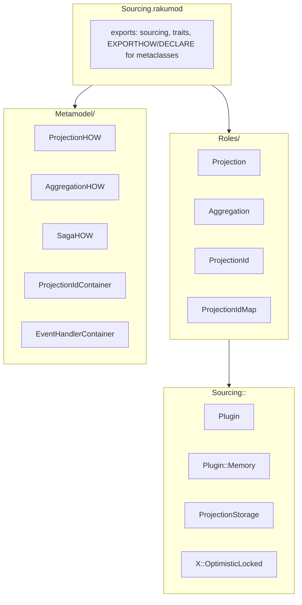
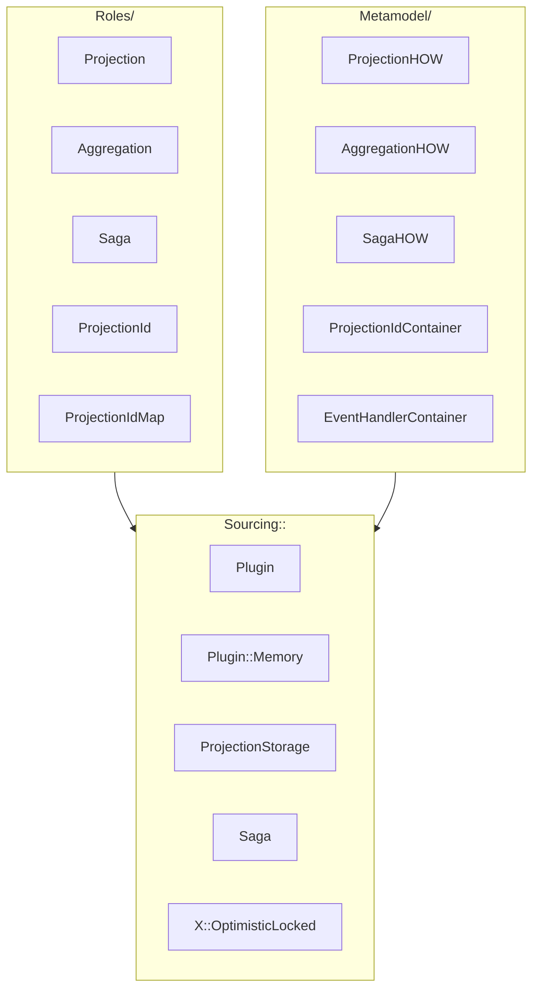
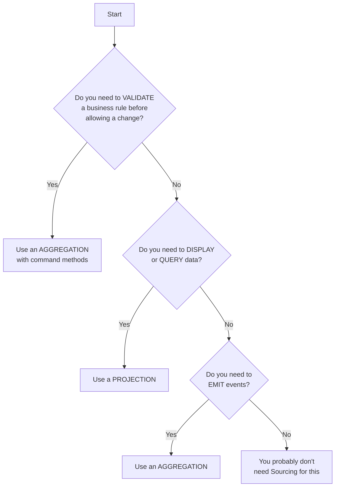

# Sourcing Library Specification

Sourcing is a Raku (Perl 6) event sourcing library that provides a declarative approach to building projections and aggregations using metaclasses, roles, and custom traits.

## Table of Contents

1. [Overview](#overview)
2. [Architecture](#architecture)
3. [Conceptual Overview](#conceptual-overview)
4. [Core API Reference](#core-api-reference)
5. [Metamodel Classes](#metamodel-classes)
6. [Plugin System](#plugin-system)
7. [Traits and Declarations](#traits-and-declarations)
8. [Storage System](#storage-system)
9. [Usage Patterns](#usage-patterns)
10. [IRC Bot Example](#irc-bot-example)

---

## Overview

Event sourcing is a pattern where state changes are stored as a sequence of events rather than updating current state directly. The Sourcing library provides:

- **Projections** (Query side / Q in CQRS): Read-only representations that evolve by applying events to build query-optimized read models. Multiple projections can be derived from the same event stream for different purposes.
- **Aggregations** (Command side / C in CQRS): Stateful entities that validate commands against current state, enforce business invariants, and emit events that describe state changes.
- **Sagas** (Orchestration): Long-running, multi-step business processes that coordinate commands across multiple aggregations. Sagas maintain state machines, track compensating transactions for rollback, and support timeout handling.
- **Declarative ID mapping**: Map event properties to projection identifiers using traits (`is projection-id`, `is projection-id<>`)
- **Plugin architecture**: Pluggable event storage backends (in-memory, database, etc.)

### Key Design Decisions

1. **Metaclass-based**: Uses custom metaclasses (`ProjectionHOW`, `AggregationHOW`, `SagaHOW`) that inherit from `Metamodel::ClassHOW` to add introspection capabilities
2. **Role-based composition**: Composes functionality through roles (`Sourcing::Projection`, `Sourcing::Aggregation`, `Sourcing::Saga`)
3. **Trait-driven**: Uses Raku's trait system (`trait_mod:<is>`) for declarative configuration
4. **Supply-based**: Uses Raku's `Supply` for event streaming

---

## Architecture

### Component Relationships



### CQRS + Event Sourcing Flow

```mermaid
flowchart TD
    subgraph CommandSide["COMMAND SIDE (C)"]
        CMD[Command]
        AGG[Aggregation<br/>consistency<br/>boundary<br/><br/>• Validates<br/>• Emits events<br/>• Enforces<br/>  invariants]
    end

    subgraph EventStore["Event Store (Plugin)"]
        ES[append-only log<br/>of immutable facts]
    end

    subgraph QuerySide["QUERY SIDE (Q)"]
        PS[Projection Storage<br/>(registry)]
        PROJ[Projections<br/>(read models)<br/><br/>• Dashboard view<br/>• Analytics view<br/>• Fraud detection<br/>• Audit log]
    end

    QUERY[Queries read from projections<br/>(never from the event store directly)]

    CMD -->|validates| AGG
    AGG -->|emit(event)| ES
    ES -->|Supply (stream)| PS
    PS -->|routes events| PROJ
    PROJ --> QUERY
```

### How Aggregations and Projections Relate

```mermaid
flowchart LR
    EVENT[Single Domain Event<br/>e.g., OrderPlaced<br/>(order-id, total)]

    subgraph Aggregates["Order Aggregate"]
        AGG[(write model)<br/><br/>• Enforced:<br/>  order total<br/>  cannot be<br/>  negative<br/><br/>• Emits:<br/>  OrderPlaced]
    end

    subgraph Proj1["Order Summary"]
        P1[(Projection)<br/><br/>• Derived:<br/>  status,<br/>  item count<br/><br/>• Used by:<br/>  order list]
    end

    subgraph Proj2["Revenue Projection"]
        P2[(Projection)<br/><br/>• Derived:<br/>  daily totals<br/>  product sales<br/><br/>• Used by:<br/>  finance dashboard]
    end

    EVENT --> AGG
    EVENT --> P1
    EVENT --> P2
```

---

## Conceptual Overview

This section explains the **why** behind projections and aggregations — not just how to declare them, but what problems they solve, when to use each, and how they fit together in a CQRS + Event Sourcing architecture.

### The Core Problem

In traditional CRUD applications, the same data model serves both writes and reads. This creates tension:

- **Write optimization** demands normalization, constraints, and transactional consistency.
- **Read optimization** demands denormalization, pre-computed aggregates, and query-specific shapes.

Event Sourcing + CQRS resolves this tension by **separating the write model from the read model**. In the Sourcing library, this separation is embodied by two constructs:

| | **Aggregation** | **Projection** |
|---|---|---|
| CQRS role | **Command side (C)** | **Query side (Q)** |
| What it does | Validates commands, emits events | Consumes events, builds read models |
| Direction | Write → Event | Event → State |
| Consistency | Strong (within boundary) | Eventually consistent |
| Rebuildable | No (source of truth) | Yes (always from events) |
| How many per stream | One | Many |

### Projections: The Read Model

**A projection transforms an event stream into a query-optimized representation.**

Think of a projection as a materialized view that stays up to date by listening to events. You don't need to replay all events every time you need to display data — the projection maintains current state.

**When to use a projection:**

- You need to display data to a user (list, detail view, dashboard)
- You need to run analytics or reports
- You need to feed data to an external system
- You need the same events shaped differently for different consumers

**Key characteristics:**

1. **Read-only** — Projections do not have auto-generated emit methods. They are observers of the event stream. (Enforced by convention — nothing prevents manual `$*SourcingConfig.emit` calls, but this breaks CQRS separation.)
2. **Rebuildable** — Given the full event stream, any projection can be reconstructed from scratch. This means you can add new projections at any time and backfill them by replaying history.
3. **Eventually consistent** — There is a delay between an event being emitted and a projection reflecting it. Design UIs and APIs to tolerate this.
4. **Purpose-specific** — Each projection serves a single query purpose. Don't build a "god projection" that serves every consumer. As Dennis Doomen puts it: *"Don't share projections."*
5. **Storage-agnostic** — Projections can persist to SQL, NoSQL, files, or in-memory. Each projection chooses its own storage mechanism based on query patterns.
6. **Resilient** — Projection code should never crash. A malformed event should be logged and skipped, not bring down the entire system.

**Best practices (from industry practitioners):**

- **Don't enforce constraints in projections.** Constraints belong in aggregations. A projection showing negative inventory is a *reporting* problem, not a validation problem.
- **Keep projections close to the consumer.** The team that needs the data should own the projection.
- **Name projections after their purpose**, not their source. `CustomerDashboardView`, not `CustomerEventProjection`.

### Aggregations: The Consistency Boundary

**An aggregation is the consistency boundary for business logic. It validates commands against current state and emits events that describe state changes.**

The aggregate is the gatekeeper. Every state change must pass through it. It answers the question: *"Given what I know right now, is this command valid?"*

**When to use an aggregation:**

- You need to enforce a business rule that must be atomically consistent (e.g., "balance cannot go negative")
- You need to validate a command against current state before allowing it
- You need an audit trail of every state change as an immutable event
- You need to replay history to understand how something reached its current state

**Key characteristics:**

1. **Emits events** — Aggregations are the only construct that can emit events. Events are immutable facts: *"AccountOpened"*, *"AmountWithdrawn"*, *"OrderShipped"*.
2. **Enforces invariants** — Business rules that must always be true are enforced inside command methods on the aggregate. If a command would violate an invariant, it `die`s before emitting any events.
3. **One aggregate = one event stream = one transaction** — All events for a given aggregate instance form a single append-only stream. Modifications happen one aggregate at a time.
4. **State is encapsulated** — Internal state (`$!attributes`) is private. External code interacts through command methods and reads public attributes.
5. **References by ID only** — Aggregations reference other aggregates by their projection ID, never by holding a direct reference.

**Aggregate design rules:**

- **Design around invariants.** The boundary of an aggregate should enclose all data needed to enforce a business rule atomically.
- **Keep aggregates small.** A few hundred events max. Large aggregates become slow to replay and prone to contention.
- **Name after domain concepts**, not technical terms. `BankAccount`, not `AccountEntity`.
- **One aggregate per transaction.** Don't try to modify multiple aggregates atomically — use eventual consistency and compensating events instead.

### Sagas: The Orchestrator

**A saga is a long-running business process that coordinates commands across multiple aggregations.** Unlike an aggregation (which is a single consistency boundary), a saga spans multiple aggregations and manages the workflow between them using the Saga pattern — if any step fails, previously completed steps are compensated (rolled back).

**When to use a saga:**

- You need to coordinate a multi-step process across multiple aggregations (e.g., create order → reserve credit → process payment → ship)
- You need to roll back completed steps if a later step fails (compensating transactions)
- You need to track the progress of a long-running workflow through named states
- You need timeout handling for steps that take too long

**Key characteristics:**

| Property | Description |
|---|---|
| **State machine** | Sagas track their progress through named states. State transitions are declared via the return type of `apply()` methods (e.g., `--> 'order-created'`). |
| **Compensating transactions** | Each step can register a compensation event. If the saga fails, `rollback()` emits compensations in LIFO order. |
| **Commands during replay are skipped** | When `^update` replays events, any commands called inside `apply()` return `Nil` immediately (via `$*SourcingReplay`). This prevents double-execution of commands on other aggregations. |
| **Incremental update** | `^update` restores cached state and applies only new events. Already-consumed events replay with commands skipped, new events replay with commands running. |
| **Cache required** | Sagas require a caching-capable plugin. Without cache, the saga cannot distinguish consumed from unconsumed events. `sourcing(SagaType, ...)` fails if the plugin doesn't support caching. |
| **Aggregation binding** | Sagas can declare attributes typed as other aggregations. At compose time, the metaclass discovers these and generates binding events. Late binding via `$!attr .= new: :id(42)` emits a `SagaAggregationBound` event. |
| **Timeout support** | Sagas can schedule timeouts with `self.timeout-in('handler-name', :$duration)` from within `apply()`. Params are forwarded to `DateTime.now.later`. The handler-name is used as the timeout identifier. `self.cancel-timeout('handler-name')` cancels it. An external scheduler calls `verify-timeouts()` periodically (~every 10s), which emits `TimedOut` events for expired timeouts. `apply(TimedOut)` dispatches to the registered handler method. |

**Best practices:**

1. **apply() records state, commands execute actions.** apply() methods should primarily update the saga's internal state. Commands on other aggregations can be called from apply() — they are automatically skipped during replay via `$*SourcingReplay`.
2. **Register compensations early.** Call `self.register-compensation: $event` as soon as a step succeeds, so rollback is always possible.
3. **Use explicit state names.** The return type syntax `--> 'state-name'` on apply methods declares the new state. Keep state names descriptive and consistent.
4. **Guard commands with `is on-state()`.** Use the trait to ensure commands only run in valid states. Supports junctions: `is on-state('pending' | 'processing')`.
5. **Commands may be retried after crashes.** If a saga crashes mid-execution, unprocessed events are re-applied on restart, which may re-run commands. Target aggregations should handle idempotent commands.
6. **Any unhandled exception triggers compensation.** If any method (including `apply()` or command methods) throws an exception, the saga automatically emits all registered compensations in LIFO order and transitions to the `'failed'` state.

**Example — An order creation saga:**

```raku
use Sourcing;
use Sourcing::Plugin::Memory;

class OrderRequested   { has $.saga-id; has $.customer-id; has $.total }
class OrderCreated     { has $.order-id; has $.customer-id; has $.total }
class CreditReserved   { has $.order-id; has $.amount }
class CreditRejected   { has $.order-id; has $.reason }
class PaymentProcessed { has $.order-id; has $.amount }
class OrderCancelled   { has $.order-id }
class CreditReleased   { has $.order-id }

saga CreateOrder {
    has Str  $.saga-id is projection-id;
    has Str  $.state = 'pending';
    has Order    $.order;
    has Customer $.customer;

    # Step 1: Handle request
    multi method apply(OrderRequested $e --> 'order-creating') {
        $!customer = sourcing Customer, :id($e.customer-id);
        $.order-created: :customer-id($e.customer-id), :total($e.total);
        self.register-compensation: OrderCancelled.new(:order-id($!order-id));
    }

    # Step 2: Order created, reserve credit
    multi method apply(OrderCreated $e --> 'credit-reserving') {
        $!order = sourcing Order, :id($e.order-id);
        $!customer.reserve-credit: :amount($e.total);
        self.register-compensation: OrderCancelled.new(:order-id($e.order-id));
        # Schedule a 30-minute timeout for the credit reservation
        self.timeout-in: 'expire-reservation', :30minutes;
    }

    # Step 3: Credit reserved, process payment
    multi method apply(CreditReserved $e --> 'processing-payment') {
        $.payment-processed: :amount($e.amount);
    }

    multi method apply(CreditRejected $e --> 'failed') {
        self.rollback;
    }

    # Timeout handler — called automatically when the timeout fires
    method expire-reservation() {
        self.rollback;
        'expired'
    }

    # Commands guarded by state
    method cancel() is on-state(none <completed failed expired>) is command {
        self.rollback;
        'cancelled'
    }
}
```

### How They Work Together



### Choosing Between Projection and Aggregation

Ask these questions:

| Question | Answer → |
|---|---|
| Does this need to **validate** a business rule before allowing the change? | **Aggregation** |
| Does this need to **emit** an event? | **Aggregation** |
| Does this need to **display** data to a user or API? | **Projection** |
| Do you need the same events shaped **differently** for different consumers? | **Multiple Projections** |
| Can this be rebuilt from scratch by replaying events? | **Projection** |
| Is this the **source of truth** for whether an action is allowed? | **Aggregation** |

---

## Core API Reference

### Sourcing.rakumod

**Purpose**: Main entry point for the library. Exports the `sourcing` function and all custom traits.

**Exports**:

| Symbol                   | Type     | Description                                            |
|--------------------------|----------|--------------------------------------------------------|
| `sourcing`                 | Sub      | Creates a fresh projection/aggregation instance            |
| `projection`               | Constant | Metaclass declaration for projections                  |
| `aggregation`              | Constant | Metaclass declaration for aggregations                 |
| `saga`                    | Constant | Metaclass declaration for sagas                        |
| `is projection-id`         | Trait    | Marks attribute as projection identifier               |
| `is projection-id-map`     | Trait    | Maps apply method to custom ID field                   |
| `is projection-id<>`       | Trait    | Shorthand for single ID mapping                        |
| `is command`               | Trait    | Wraps method with reset, replay, validation, and auto-retry |
| `is command(False)`        | Trait    | Marks a method as explicitly NOT a command. Prevents `AggregationHOW` from auto-generating an event-emitting method with the same name. |
| `is on-state()`            | Trait    | Guards command execution to specific saga states (supports junctions) |

**Public API**:

```raku
sub sourcing(Sourcing::Projection:U $proj, *%ids) is export
# Creates a fresh projection/aggregation instance with given IDs
# - $proj: The projection/aggregation class
# - %ids: Named parameters for projection ID values
# Returns: Fresh instance with all events applied

sub sourcing-config is rw is export
# Global configuration accessor (PROCESS::<$SourcingConfig>)
```

**Example Usage**:
```raku
use Sourcing;

my $proj = sourcing MyProjection, :id(42);
# Creates fresh MyProjection instance with id=42, applies all events
```

**How it works**:
1. Retrieves all events for the given identity from the store via `$*SourcingConfig.get-events-after: -1`
2. Creates a fresh instance with all events applied
3. Sets `__current-version__` to total events minus one
4. Stores updated cached data

---

### Sourcing::Projection

**Purpose**: Role applied to all projection classes via metaclass. Provides the event application infrastructure that transforms an event stream into a read-optimized model.

**Conceptual role**: A projection is the **read side** of CQRS. It listens to events and builds a state representation optimized for querying. Projections never emit events — they are pure consumers of the event stream.

> *"Projections in Event Sourcing are a way to derive the current state from an event stream. You don't need to replay all the events every time you need to display data."* — Derek Comartin

**Location**: `lib/Sourcing/Projection.rakumod`

**Key characteristics**:

| Property | Description |
|---|---|
| **No auto-generated emits** | Projections do not have auto-generated emit methods. They observe; they don't command. (Enforced by convention.) |
| **Rebuildable** | Given the full event stream, any projection can be reconstructed from scratch. Add a new projection today and backfill it by replaying history. |
| **Eventually consistent** | There is a delay between an event being emitted and a projection reflecting it. This is by design. |
| **Purpose-specific** | Each projection serves a single query purpose. Don't build a "god projection." |
| **Storage-agnostic** | Each projection chooses its own storage mechanism (SQL, NoSQL, in-memory, files) based on query patterns. |
| **Resilient** | Projection code should never crash. Malformed events should be logged and skipped. |

**Best practices**:

1. **Don't enforce constraints.** Constraints belong in aggregations. A projection showing stale or unexpected data is a reporting concern, not a validation concern.
2. **One projection per query purpose.** If two consumers need different data shapes, give them separate projections.
3. **Keep projections close to the consumer.** The team that needs the data should own the projection.
4. **Name projections after their purpose**, not their source. `CustomerDashboardView`, not `CustomerEventProjection`.
5. **Make apply methods idempotent.** Applying the same event twice should produce the same state.

**Attributes**:
```raku
has $!__current-version__;
# Internal version tracking: index of last event applied during replay.
# Set to -1 when no events exist, or @events.elems - 1 after replay.
```

**Public Methods**:
```raku
multi method new(:@initial-events!, |c)
# Creates projection and applies initial events
# - @initial-events: Events to apply on creation
# Returns: New projection instance with events applied
```

**Interactions**:
- Automatically composed into classes using `projection` metaclass
- Provides `apply` method signature that event handlers must match
- Works with `EventHandlerContainer` to discover event types

**Example — A projection for a customer dashboard**:

```raku
use Sourcing;

class CustomerNameChanged  { has $.customer-id; has $.name }
class CustomerAddressChanged { has $.customer-id; has $.address }
class OrderPlaced          { has $.customer-id; has $.total; has $.date }

# Projection: customer dashboard view
projection CustomerDashboard {
    has Int $.customer-id is projection-id;
    has Str $.name;
    has Str $.address;
    has Int $.order-count = 0;
    has Rat $.total-spent = 0;

    multi method apply(CustomerNameChanged $e) {
        $!name = $e.name;
    }

    multi method apply(CustomerAddressChanged $e) {
        $!address = $e.address;
    }

    multi method apply(OrderPlaced $e) {
        $!order-count++;
        $!total-spent += $e.total;
    }
}

# Usage: get the dashboard for a specific customer
my $dashboard = sourcing CustomerDashboard, :customer-id(42);
say "Customer: $dashboard.name";
say "Orders: $dashboard.order-count";
say "Total spent: $dashboard.total-spent";
```

This projection listens to three different event types and builds a single read model optimized for displaying a customer's dashboard. The same events could feed a completely different projection (e.g., `RevenueByMonth`) without any coupling between them.

---

### Sourcing::Aggregation

**Purpose**: Role marker that identifies a class as an aggregation — the **write side** of CQRS. Aggregations validate commands against current state and emit events that describe state changes.

**Conceptual role**: An aggregation is the **consistency boundary** for business logic. It is the gatekeeper that answers: *"Given what I know right now, is this command valid?"* If yes, it emits an immutable event. If no, it rejects the command (via `die`).

> *"An aggregate is a cluster of domain objects that can be treated as a single unit. It enforces invariants — business rules that must always be true — within its boundary."* — Domain-Driven Design

**Location**: `lib/Sourcing/Aggregation.rakumod`

**Key characteristics**:

| Property | Description |
|---|---|
| **Emits events** | Aggregations are the only construct that can emit events. Events are immutable facts: `OrderPlaced`, `AmountWithdrawn`. |
| **Enforces invariants** | Business rules that must always be true are enforced inside command methods. If a command would violate an invariant, it `die`s before emitting any events. |
| **One aggregate = one event stream = one transaction** | All events for a given aggregate instance form a single append-only stream. |
| **State is encapsulated** | Internal state (`$!attributes`) is private. External code interacts through command methods and reads public attributes. |
| **References by ID only** | Aggregations reference other aggregates by their projection ID, never by holding a direct reference. |
| **Source of truth** | The event stream emitted by an aggregate is the authoritative record of what happened. State can always be rebuilt from it. |

**Best practices**:

1. **Design around invariants.** The boundary of an aggregate should enclose all data needed to enforce a business rule atomically. If two rules must be enforced together, they belong in the same aggregate.
2. **Keep aggregates small.** A few hundred events max. Large aggregates become slow to replay and prone to optimistic locking contention.
3. **Name after domain concepts**, not technical terms. `BankAccount`, not `AccountEntity`.
4. **One aggregate per transaction.** Don't try to modify multiple aggregates atomically — use eventual consistency and compensating events instead.
5. **Validate before emitting.** Put all domain checks at the top of command methods, before any `$.event` calls. A `die` prevents any events from being persisted.
6. **Never mutate state directly in commands.** State changes happen *only* through event emission and the corresponding `apply` methods.

**Note**: This is primarily a marker role. The actual event emission functionality is implemented in `AggregationHOW` metaclass which adds command methods that call `$*SourcingConfig.emit`.

**Interactions**:
- Composed by `AggregationHOW` metaclass
- Inherits from `ProjectionHOW`, so aggregations are also projections (they can consume events via `apply`)
- `AggregationHOW` auto-generates event-emitting methods for each handled event type

**Example — An aggregate handling a command with validation**:

```raku
use Sourcing;

class AccountOpened   { has $.account-id; has $.initial-balance }
class AmountDeposited { has $.account-id; has $.amount }
class AmountWithdrawn { has $.account-id; has $.amount }
class AccountClosed   { has $.account-id }

aggregation BankAccount {
    has Int $.account-id is projection-id;
    has Rat $.balance = 0;
    has Bool $.is-open = False;

    # State changes come ONLY from events
    multi method apply(AccountOpened $e) {
        $!balance = $e.initial-balance;
        $!is-open = True;
    }
    multi method apply(AmountDeposited $e) { $!balance += $e.amount }
    multi method apply(AmountWithdrawn $e) { $!balance -= $e.amount }
    multi method apply(AccountClosed $e)   { $!is-open = False }

    # Command: validates before emitting
    method withdraw(Rat $amount) is command {
        die "Account is closed" unless $!is-open;
        die "Amount must be positive" if $amount <= 0;
        die "Insufficient funds: balance is $!balance" if $!balance < $amount;

        $.amount-withdrawn: :$amount;
    }

    method deposit(Rat $amount) is command {
        die "Account is closed" unless $!is-open;
        die "Amount must be positive" if $amount <= 0;

        $.amount-deposited: :$amount;
    }

    method close() is command {
        die "Account is already closed" unless $!is-open;
        die "Cannot close account with non-zero balance ($!balance)"
            if $!balance != 0;

        $.account-closed;
    }
}

# Usage:
my $account = sourcing BankAccount, :account-id(1);
$account.account-opened: initial-balance => 1000;

$account.^update;  # Replay to get current state
$account.withdraw(200);  # ✅ Emits AmountWithdrawn event
$account.withdraw(900);  # ❌ dies: "Insufficient funds: balance is 800"
```

In this example, the `BankAccount` aggregate enforces three invariants:
1. Closed accounts cannot accept deposits or withdrawals
2. Withdrawals cannot exceed the current balance
3. Accounts can only be closed when the balance is exactly zero

These rules are enforced *before* any event is emitted, guaranteeing that the event stream never contains invalid state transitions.

---

### Sourcing::ProjectionId

**Purpose**: Role applied to attributes via the `is projection-id` trait. Marks attributes as projection identifiers.

**Location**: `lib/Sourcing/ProjectionId.rakumod`

**Public Methods**:
```raku
method is-projection-id { True }
# Returns True to identify this as a projection ID attribute
```

**Interactions**:
- Applied via `trait_mod:<is>(Attribute $r, Bool :$projection-id)`
- Discovered by `ProjectionIdContainer` during composition

---

### Sourcing::ProjectionIdMap

**Purpose**: Role applied to methods to store custom ID mapping configuration.

**Location**: `lib/Sourcing/ProjectionIdMap.rakumod`

**Attributes**:
```raku
has Str %.projection-id-map{Str};
# Maps projection ID names to event field names
```

**Public Methods**:
```raku
method projection-id-map { %!projection-id-map }
# Returns the mapping hash
```

**Interactions**:
- Applied via `is projection-id-map` or `is projection-id<>` traits
- Used by `EventHandlerContainer` when building event handlers

---

### Sourcing::Saga

**Purpose**: Role applied to all saga classes. Provides state machine, compensation tracking, timeout scheduling, and aggregation binding infrastructure.

**Location**: `lib/Sourcing/Saga.rakumod`

**Key characteristics**:

| Property | Description |
|---|---|
| **Inherits from aggregation** | A saga is both an aggregation and a projection. It can emit events (via inherited command methods) and consume events (via `apply` methods). |
| **State machine** | Each `apply` method declares its resulting state via the return type syntax `--> 'state-name'`. The saga transitions through named states as events are processed. |
| **Compensation stack** | Sagas maintain a LIFO stack of compensation events registered via `register-compensation`. On failure, `rollback()` emits them in reverse order. |
| **Aggregation binding** | Attributes typed as aggregations are loaded lazily via `sourcing()` when the saga binds to them. |
| **Timeout scheduling** | Timeouts can be scheduled with `timeout-in($duration, 'handler-name')`. |
| **Exception handling** | Any unhandled exception in an `apply` or command method triggers automatic compensation and transitions to `'failed'` state. |

**Attributes**:
```raku
has Str  $.state;                   # Current saga state
has Mu   @!compensations;           # LIFO stack of compensation events
has Pair @!timeout-schedule;        # Array of Pair — DateTime => Set of method-names, kept ordered
has Hash %!timeout-handlers{Str}; # method-name => Hash{:date-time, :method-name}
```

**Public Methods**:
```raku
method register-compensation(Mu $event)
# Adds compensation event to the LIFO stack.
# Call immediately after a step succeeds so rollback is always possible.

method timeout-in(Str $method-name, *%params)
# Schedules a timeout:
# 1. Computes scheduled-at = DateTime.now.later: |%params
# 2. Adds to %!timeout-handlers: $method-name => Hash{:date-time, :method-name}
# 3. Adds to @!timeout-schedule: $date-time => Set($method-name) (as a Pair, keeping order)
# 4. Emits TimeOutScheduled event with the method-name and scheduled-at
# Can only be called from within an apply() method.

method rollback() is command
# Emits all registered compensations in LIFO order.
# Clears the compensation stack.
# Called automatically when any exception is thrown.

method verify-timeouts() is command
# Iterates over @!timeout-schedule (which is ordered by DateTime)
# While the next entry's DateTime is <= DateTime.now:
#   1. Gets the handler name from the Set
#   2. Emits TimedOut event with the handler name
#   3. Removes the entry from @!timeout-schedule
# This command should be called periodically (e.g., every 10 seconds)
# by an external scheduler or background process.

method cancel-timeout(Str $method-name)
# Cancels a scheduled timeout by name:
# 1. Removes the entry from %!timeout-handlers
# 2. Removes all entries with that method-name from @!timeout-schedule
```

**Internal Classes**:
```raku
class TimeOutScheduled {
    has Str  $.handler-name;    # Method name to call when fired
    has DateTime $.scheduled-at; # When the timeout fires
}

class TimedOut {
    has Str $.handler-name;  # Matches the name from TimeOutScheduled
}

class SagaCreated {
    has $.saga-id;
    has $.saga-type;
    has Hash %.aggregation-ids;  # { attr-name => { id-name => value, ... }, ... }
}

class SagaAggregationBound {
    has $.saga-id;
    has Str  $.attribute-name;
    has Str  $.aggregation-type;
    has Hash %.ids;  # projection-id field names => values
}
```

**How Timeout Scheduling Works (step by step)**:

1. **Scheduling** (inside `apply()`):
   ```
   self.timeout-in: "cancel-order", :30seconds;
   ```
   - Computes `scheduled-at = DateTime.now.later(:30seconds)`
   - Stores in `%!timeout-handlers`: `"cancel-order" => {:date-time(...), :method-name("cancel-order")}`
   - Stores in `@!timeout-schedule`: `Pair.new(DateTime(...), Set.new("cancel-order"))`
   - Emits `TimeOutScheduled` event (persisted to event store)

2. **Replaying TimeOutScheduled** (inside `apply(TimeOutScheduled $e)`):
   - Restores the entry into `%!timeout-handlers` and `@!timeout-schedule`
   - This ensures the timeout is rescheduled if the saga is rebuilt

3. **Firing timeouts** (via `verify-timeouts()` command, called every ~10 seconds):
   ```
   for @!timeout-schedule {
       last if .key > DateTime.now;           # not yet
       my $handler-name = .value.head;        # get handler name
       $.timed-out: handler-name => $handler-name;  # emit TimedOut event
       .value; .value.clear;                  # mark as fired
   }
   @!timeout-schedule .= grep: .value.Bool;   # remove fired entries
   ```

4. **Handling TimedOut** (inside `apply(TimedOut $e)`):
   - Gets the handler name from `$.handler-name`
   - Looks up `$handler-name` in `%!timeout-handlers` to get the stored metadata
   - Calls `$self."$handler-name"()` via dynamic method dispatch

5. **Canceling a timeout** (inside `apply()`):
   To cancel a timeout, simply call `cancel-timeout` with the handler name:
   ```
   self.cancel-timeout: "cancel-order";
   ```
   This removes the entry from `%!timeout-handlers` and all entries with that method-name from `@!timeout-schedule`.

**Interactions**:
- Composed by `SagaHOW` metaclass
- Inherits from `Sourcing::Aggregation`, so sagas are also aggregations (can emit events)
- `SagaHOW` auto-generates `apply` handlers for internal events (`TimeOutScheduled`, `TimedOut`, `SagaCreated`, `SagaAggregationBound`)

**Example — A transfer saga with timeouts:**

```raku
saga AccountTransfer {
    has Str    $.saga-id is projection-id;
    has Str    $.state = 'pending';
    has Account $.from-account;
    has Account $.to-account;
    has Rat    $.amount;

    multi method apply(TransferRequested $e --> 'ready') {
        $!from-account = sourcing Account, :id($e.from-id);
        $!to-account   = sourcing Account, :id($e.to-id);
        $!amount = $e.amount;
        self.timeout-in: 'cancel-transfer', :5minutes;
    }

    method execute() is on-state('ready') is command {
        $!from-account.withdraw: $!amount;
        'transferring'
    }

    multi method apply(Withdrawn $e --> 'depositing') {
        $!to-account.deposit: $!amount;
        self.register-compensation: WithdrawnReversed.new(:id($e.id), :amount($e.amount));
        self.register-compensation: DepositedReversed.new(:id($e.id), :amount($!amount));
        # Replace the cancellation timeout (scheduled earlier) with a delivery confirmation timeout
        # Calling timeout-in with the same handler name automatically replaces the previous timeout
        self.timeout-in: 'confirm-delivery', :5minutes;
    }

    multi method apply(Deposited $e --> 'completed') { }

    # Timeout handler — called automatically when the timeout fires
    method cancel-transfer() {
        self.rollback;
        'cancelled'
    }

    method confirm-delivery() is on-state('depositing') {
        # Final confirmation step
        'completed'
    }

    method cancel() is on-state(none <completed rolled-back>) is command {
        self.rollback;
        'rolled-back'
    }
}

# External scheduler calls verify-timeouts periodically:
every-10-seconds:
    for @active-sagas {
        $_.verify-timeouts;
    }
```

---

---

## Metamodel Classes

### Metamodel::ProjectionHOW

**Purpose**: Metaclass for projection classes. Inherits from `Metamodel::ClassHOW` and composes the `Sourcing::Projection` role.

**Location**: `lib/Metamodel/ProjectionHOW.rakumod`

**Public Methods**:
```raku
method compose(Mu $proj, |)
# Composes the projection class:
# 1. Adds Sourcing::Projection role
# 2. Calls compose-projection-id from ProjectionIdContainer
# 3. Calls nextsame for standard composition

method update($proj)
# Incremental update from cached state:
# 1. Gets cached last-id and data from the store
# 2. Restores cached attribute values (preserving projection-ids)
# 3. Fetches events AFTER the applied version from the store
# 4. Applies each new event via $proj.apply: $event
# 5. Updates $!__current-version__ and stores updated cache
# For sagas: commands in apply() are skipped for already-consumed events
#   (via $*SourcingReplay) and only run for truly new events.

method rebuild($proj)
# Full reset and replay from the event store:
# 1. Creates a fresh instance to obtain default attribute values
# 2. Resets all mutable attributes (preserving projection-id attributes)
# 3. Fetches ALL events from the store (from version -1)
# 4. Applies each event with $*SourcingReplay = True (commands are skipped)
# 5. Updates $!__current-version__ to total events applied minus one
# 6. Stores updated cached data via $*SourcingConfig.store-cached-data
# Use this when fixing bugs in apply() methods that require re-processing
# all historical events.
```

**Introspection Methods** (provided by composed roles):
```raku
$proj.^projection-ids          # Array of projection ID attributes
$proj.^projection-id-names    # Array of ID attribute names (without $!)
$proj.^projection-id-pairs    # Map of ID name to current value
$proj.^handled-events         # Array of event types
$proj.^handled-events-map     # Hash of event type to ID mappings
```

**Interactions**:
- Composes `Metamodel::ProjectionIdContainer` role
- Composes `Metamodel::EventHandlerContainer` role
- Automatically composes `Sourcing::Projection` role into classes

---

### Metamodel::AggregationHOW

**Purpose**: Metaclass for aggregation classes. Extends `ProjectionHOW` and adds automatic command method generation.

**Location**: `lib/Metamodel/AggregationHOW.rakumod`

**Public Methods**:
```raku
method compose(Mu $aggregation, |)
# Composes aggregation:
# 1. Calls parent compose (adds Projection role)
# 2. Adds Sourcing::Aggregation role
# 3. For each handled event type:
#    - Creates lowercase method name (kebab-case)
#    - Method accepts event parameters
#    - Builds event with projection ID values from self
#    - Emits event via $*SourcingConfig.emit
#    - Returns created event
```

**Automatic Event Emitting Method Generation**:
For an event `MyEvent` with projection ID `$!id`:
- Creates method `my-event($value)` 
- Sets `id` field from `$!id` attribute
- Accepts additional named parameters
- Emits event to the supply
- Returns the emitted event

**Interactions**:
- Inherits from `Metamodel::ProjectionHOW`
- Composes `Sourcing::Aggregation` role
- Works with `handled-events-map` to discover events

---

### Metamodel::SagaHOW

**Purpose**: Metaclass for saga classes. Extends `AggregationHOW` and composes the `Sourcing::Saga` role.

**Location**: `lib/Metamodel/SagaHOW.rakumod`

**Public Methods**:
```raku
method compose(Mu $saga, |)
# Composes saga:
# 1. Calls parent compose (adds Projection + Aggregation roles)
# 2. Adds Sourcing::Saga role
# 3. Discovers aggregation-typed attributes (attributes whose type does Sourcing::Aggregation)
# 4. Generates SagaCreated event class with nullable ID fields for each aggregation attribute
# 5. Generates SagaAggregationBound event class
# 6. Overrides attribute accessors for aggregation binding:
#    - Read: returns the current value (loaded via sourcing on first write)
#    - Write: emits SagaAggregationBound event, then sets the value
# 7. Validates state names: collects all --> 'state-name' return values from apply
#    methods and verifies that is on-state() guards only reference known states
# 8. Wraps all methods with exception handling: any uncaught exception triggers
#    rollback() and transitions to 'failed' state

method update($saga)
# Incremental update (inherited from ProjectionHOW):
# 1. Gets cached last-id and data from the store
# 2. Restores cached attribute values (including $.state and other saga attributes)
# 3. For already-consumed events: replays with $*SourcingReplay = True (commands skipped)
# 4. For new events: replays with $*SourcingReplay = False (commands run)
# 5. Updates $.state from the return value of each apply() call
# 6. Stores updated cache
```

**Automatic Aggregation Binding**:
For an attribute `has Order $.order;` where Order is an aggregation:

- During compose, SagaHOW detects that Order does `Sourcing::Aggregation`
- Generates a write-intercepting accessor that:
  - Emits `SagaAggregationBound` event with the attribute name, type, and projection IDs
  - Sets the attribute value directly (bypassing the accessor on subsequent reads)
- During replay of `SagaAggregationBound`, the saga loads the aggregation via `sourcing()`
- This enables direct method calls: `$!order.withdraw: 100`

**Timeout Infrastructure**:
SagaHOW auto-generates `apply` methods for the internal timeout events:

- `apply(TimeOutScheduled $e)` — rebuilds `%!timeout-handlers` and `@!timeout-schedule` from the persisted event
- `apply(TimedOut $e)` — gets the handler-name from `$.handler-name`, looks it up in `%!timeout-handlers`, and dispatches to it

The external scheduler must periodically call `verify-timeouts()` on each active saga instance.

**State Validation**:
- At compose time, collects all `--> 'state-name'` return values from apply methods
- Validates that `is on-state()` guards on command methods reference only known states
- Throws at compile time if an unknown state is referenced

**Interactions**:
- Inherits from `Metamodel::AggregationHOW`
- Composes `Sourcing::Saga` role
- Works with `Sourcing::Saga` to provide exception-based compensation

---

---

### Metamodel::ProjectionIdContainer

**Purpose**: Role providing projection ID introspection. Composed into `ProjectionHOW`.

**Location**: `lib/Metamodel/ProjectionIdContainer.rakumod`

**Attributes**:
```raku
has @!projection-ids;
# Private array storing projection ID attributes
```

**Public Methods**:
```raku
multi method compose-projection-id(Mu $proj)
# Called during composition to collect projection ID attributes
# Iterates over $proj.^attributes, selects those doing Sourcing::ProjectionId
# Stores them in @!projection-ids

method projection-ids(|)
# Returns array of projection ID attributes

method projection-id-names(|)
# Returns array of ID names without $! prefix

method projection-id-pairs(Mu $proj --> Map())
# Returns Map of ID name to current value for given instance
# Example: Map.new(('id' => 42))
```

---

### Metamodel::EventHandlerContainer

**Purpose**: Role providing event handler introspection. Composed into metaclasses.

**Location**: `lib/Metamodel/EventHandlerContainer.rakumod`

**Attributes**:
```raku
has $!events-handled-by;
has $!events-handled-map;
has $!events-handled-reverse-map;
# Caches for event type introspection
```

**Public Methods**:
```raku
method handled-events(Mu $proj --> Array())
# Returns array of event types handled by apply methods
# Inspects multi candidates of apply method
# Returns types of first positional parameter (after self)

method handled-events-map(Mu $proj)
# Returns Hash mapping event type to ID mapping
# Each entry: EventType => Hash mapping projection ID to event field
# Example: MyEvent => {:id<id>, :name<name>}
```

**How it works**:
1. Finds `apply` method on projection
2. Iterates over multi candidates
3. Extracts first positional parameter type (skips `self`)
4. Checks for `projection-id-map` trait on method
5. Combines with default mappings from projection IDs

---

## Plugin System

### Sourcing::Plugin

**Purpose**: Abstract role defining the interface for event storage backends.

**Location**: `lib/Sourcing/Plugin.rakumod`

**Abstract Methods**:
```raku
method emit($, :$current-version)
# Emit an event to the system
# - $event: The event to emit
# - :$current-version: Optional version for optimistic locking

method get-events(%ids, %map)
# Retrieve events matching IDs and event type map

method get-events-after($, %, %)
# Retrieve events after a given version ID

method supply
# Returns the Supply of events

method store-cached-data(Mu:U, %)
# Store cached state for a projection

method get-cached-data(Mu:U, %)
# Retrieve cached state for a projection
```

**Public Methods**:
```raku
method use(|c)
# Class method to install plugin as global config
# Sets PROCESS::<$SourcingConfig> to plugin instance
# Example: Sourcing::Plugin::Memory.use
```

### Dynamic Variables

```raku
 $*SourcingReplay
 # When truthy, suppresses command execution entirely (returns Nil).
 # Set during ^rebuild and during replay of already-consumed saga events.
 # Commands that see $*SourcingReplay skip their entire body — no validation,
 # no event emission, no side effects.
 # Example: my $*SourcingReplay = True;
```

---

### Sourcing::Plugin::Memory

**Purpose**: In-memory implementation of the Plugin interface. Suitable for testing and development.

**Location**: `lib/Sourcing/Plugin/Memory.rakumod`

**Attributes**:
```raku
has Supplier $.supplier;
has Supply() $.supply;
has @.events;
has %.store;
# Supplier: emits events
# supply: tap that pushes to @.events
# events: all emitted events
# store: cached projection state
```

**Public Methods**:
```raku
multi method emit($event)
# Simple emit to supplier

multi method emit($event, :$type, :%ids!, :$current-version!)
# Emit with optimistic locking support
# - Gets cached data for type/ids
# - Uses CAS (compare-and-swap) for atomic version checking
# - Throws X::OptimisticLocked if version mismatch detected

method get-events(%ids, %map)
# Filter events by IDs and event type map
# Uses internal &get-events helper

method get-events-after(Int $id, %ids, %map)
# Get events after a specific version ID

method number-of-events
# Returns total event count

multi method store-cached-data($proj where *.HOW.^can("data-to-store"), UInt :$last-id!)
# Store using custom data-to-store method
# If your projection defines a `data-to-store` method, it will be called
# to produce the cached data instead of extracting all public attributes.
# This allows selective serialization — only cache what you need.
#
# Example:
#   method data-to-store {
#       :$.id, :$.name, :$.email  # omit sensitive fields
#   }

multi method store-cached-data($proj, Int :$last-id!)
# Store by extracting all public attributes

multi method store-cached-data(Mu:U $proj, %ids, %data, Int :$last-id!)
# Core storage: stores in %!store{ProjectionName}{IDs} => {data, last-id}

method get-cached-data(Mu:U $proj, %ids) is rw
# Retrieves cached state, returns Hash with:
# - last-id: atomicint (default -1)
# - data: Hash of projection attributes
```

**Internal Helper**:
```raku
sub get-events(@events, %ids, %map)
# Filters events:
# 1. Keep events where type matches %map keys
# 2. For matching types, check ID fields match %ids values
```

---

## Storage System

### Sourcing::ProjectionStorage

**Purpose**: Special projection that maintains a registry of all projections. Enables automatic projection updates. Declared as an `aggregation` so it can emit `ProjectionRegistered` events while also consuming events to route them to registered projections.

**Location**: `lib/Sourcing/ProjectionStorage.rakumod`

**Declaration**:
```raku
unit aggregation Sourcing::ProjectionStorage;
# Uses 'aggregation' to enable event emission
```

**Attributes**:
```raku
has $.id is projection-id = 1;
has %.registries;
has $.supply;
```

**Internal Classes**:
```raku
class ProjectionRegistered {
    has Mu:U $.type;
    has Str $.name;
    has Str @.ids;
    has Hash %.map{Mu};
}

class Registry {
    has Str $.name;
    has Mu:U $.type;
    has @.ids;
    has %.map;
}
```

**Public Methods**:
```raku
method start
# Starts the supply and returns a Promise that resolves when the supply completes:
# 1. Creates sourcing self.WHAT
# 2. Listens to $*SourcingConfig.supply
# 3. Applies events to this storage projection
# 4. Returns a Promise (awaitable) that resolves when the supply is done

multi method apply(ProjectionRegistered (Mu:U :$type, Str :$name, :%map, :@ids))
# Registers a new projection type:
# 1. Adds entries to %!registries for each event type
# 2. Maps event type => Registry

method register(Mu:U $type)
# Registers a projection type
# Emits ProjectionRegistered event

multi method apply(Any $event)
# Routes event to all matching projections:
# 1. Look up registries for event type
# 2. For each registered projection:
#    - Extract ID values from event
#    - Call sourcing to get/create projection (replays all events)
#    - Events are applied through the projection's apply method
#
# NOTE: This has O(n²) performance for large event streams since each event
# triggers a full replay of all events for every registered projection.
# For production use with large event streams, consider implementing
# incremental projection updates (applying only the new event to an
# existing cached projection instance) rather than full replay.
```

**Usage**:
```raku
my $storage = Sourcing::ProjectionStorage.new;
await $storage.start;

$storage.register: MyProjection;

# Now any emitted event will automatically update MyProjection instances
```

---

## Traits and Declarations

### Declaring a Projection

```raku
use Sourcing;

projection MyProjection {
    has Int $.id is projection-id;
    has Str $.name;
    
    multi method apply(MyEvent $e) {
        $!name = $e.name;
    }
}
```

**What happens**:
1. `projection` constant triggers `Metamodel::ProjectionHOW`
2. During compose: adds `Sourcing::Projection` role
3. `is projection-id` marks `$.id` as projection identifier
4. Introspection methods become available

### Declaring an Aggregation

```raku
use Sourcing;

aggregation MyAggregation {
    has Int $.id is projection-id;
    has Int $.count = 0;
    
    method apply(MyEvent $e) {
        $!count++;
    }
    
    # Automatically generates my-event() method
}
```

**What happens**:
1. `aggregation` triggers `Metamodel::AggregationHOW` (extends ProjectionHOW)
2. Adds both `Sourcing::Projection` and `Sourcing::Aggregation` roles
3. Generates command methods: `my-event(:$value)` creates `MyEvent` and emits it

### Declaring a Saga

```raku
use Sourcing;

saga MySaga {
    has Str     $.saga-id is projection-id;
    has Str     $.state = 'pending';
    has Order    $.order;       # Aggregation-typed attribute
    has Customer $.customer;     # Late binding via $!customer .= new: :id(42)

    # State transitions via apply() return types
    multi method apply(OrderRequested $e --> 'creating') {
        $!customer = sourcing Customer, :id($e.customer-id);
        $.order-created: :customer-id($e.customer-id), :total($e.total);
    }

    multi method apply(OrderCreated $e --> 'credit-reserving') {
        $!order = sourcing Order, :id($e.order-id);
        $!customer.reserve-credit: :amount($e.total);
        self.register-compensation: OrderCancelled.new(:order-id($e.order-id));
    }

    multi method apply(CreditReserved $e --> 'completed') { }

    # State-guarded command
    method cancel() is on-state(none <completed rolled-back>) is command {
        self.rollback;
        'rolled-back'
    }
}
```

**What happens**:
1. `saga` constant triggers `Metamodel::SagaHOW` (extends AggregationHOW)
2. Adds `Sourcing::Projection`, `Sourcing::Aggregation`, and `Sourcing::Saga` roles
3. Validates that all `is on-state()` guards reference known states
4. Generates `apply` handlers for internal events: `TimeOutScheduled`, `TimedOut`, `SagaCreated`, `SagaAggregationBound`
5. Discovers aggregation-typed attributes and generates binding accessors
6. Wraps all methods with exception handling for automatic compensation

### The `is on-state()` Trait

The `is on-state()` trait guards command execution to specific saga states. It prevents commands from running when the saga is in an invalid state.

```raku
method cancel() is on-state('pending') is command { ... }
method retry() is on-state('pending' | 'failed') is command { ... }
method expire() is on-state(none <completed rolled-back>) is command { ... }
method process() is on-state(any <pending processing>) is command { ... }
```

**Supported forms**:

| Form | Example | Description |
|---|---|---|
| Single string | `'pending'` | Only in the named state |
| Junction (any) | `'pending' \| 'processing'` | In any of the listed states |
| Junction (none) | `none <completed rolled-back>` | In none of the listed states |
| Junction (all) | `all <ready processing>` | In all listed states (uncommon) |

The trait uses Raku's smartmatch operator (`~~`) to check the current state against the guard.

**Validation**: At compose time, `SagaHOW` validates that all `is on-state()` guards reference states declared in `apply` method return types. Unknown state names cause a compile-time error.

### Projection ID Mapping

Default mapping (event field = projection ID name):
```raku
projection A {
    has Int $.id is projection-id;  # Event field 'id' maps to $!id
    
    method apply(MyEvent $e) { }  # Event.$id matches $!id
}
```

Custom mapping via `is projection-id-map`:
```raku
projection B {
    has Int $.id is projection-id;
    
    # Map applies to MyEvent: event field 'x' maps to $!id
    method apply(MyEvent $e) is projection-id-map{ id => "x" } { }
}
```

Shorthand via `is projection-id<>`:
```raku
projection C {
    has Int $.id is projection-id;
    
    # Maps the single projection-id attribute to the 'x' field on the event
    method apply(MyEvent $e) is projection-id< x > { }
}
```
This trait requires exactly one `is projection-id` attribute on the class
and maps it to the specified event field name.

### Command Methods

Commands are the **write entry points** for aggregations. They exist to provide a safe place to validate business rules against the current aggregate state *before* emitting events that become immutable facts.

#### Why Commands Exist: Two Levels of Validation

Every command passes through two validation gates:

1. **Superficial validation** — Required fields, format checks, valid ranges. This happens *before* the command reaches the domain layer (e.g., at the API or CLI boundary). A command with missing required fields should never be instantiated.

2. **Domain validation** — Business rules that depend on aggregate state. This happens *inside* the command method. Examples: "withdrawal cannot exceed account balance", "order cannot be cancelled after shipping", "counter cannot go below zero."

Commands are the right place for domain validation because they run against the **most recent state** of the aggregation. The aggregate is the consistency boundary — one aggregate = one event stream = one transaction. All modifications flow through command methods on the aggregate root.

```raku
# ✅ Good: domain validation inside command
method withdraw(Decimal $amount) is command {
    die "Insufficient funds" if $!balance < $amount;
    $.withdrawn: :$amount;
}

# ❌ Bad: validation outside the aggregate (race condition window)
sub withdraw-from-outside($agg, $amount) {
    die "Insufficient funds" if $agg.balance < $amount;  # stale by the time this runs
    $agg.withdrawn: :amount($amount);
}
```

#### The Command Lifecycle

Every `is command` method follows this exact flow:

```mermaid
flowchart TD
    START[Command called] --> UPDATE[1. ^update: Incremental Update<br/>• Restore cached state<br/>• Apply only NEW events<br/>• For sagas: skip commands<br/>  on already-consumed events]
    
    UPDATE --> BODY[2. Execute command body<br/>• Validate against state<br/>• die() if validation fails<br/>• Emit events via $.event<br/>• For sagas: exception<br/>  triggers rollback + failed]
    
    BODY --> LOCK[3. Optimistic lock check<br/>• Store detects if new<br/>  events appeared since<br/>  the ^update call<br/>• Throws X::OptimisticLocked<br/>  if contention detected]
    
    LOCK --> DECIDE{Contention?}
    DECIDE -->|No| SUCCESS[Return result]
    DECIDE -->|Yes| RETRY[Retry (up to 5x)]
    RETRY --> UPDATE
    
    LOCK -.->|all retries exhausted| FAIL[Throw X::OptimisticLocked]
```

#### Automatic Retry Behavior

When `X::OptimisticLocked` is thrown, the command **automatically retries** — up to 5 attempts. This is intentional and correct for event sourcing, unlike CRUD systems where automatic retry is discouraged.

**Why automatic retry works in event sourcing:**

| CRUD Systems | Event Sourcing with Aggregates |
|---|---|
| User edits a form with merged state they need to review | Command parameters are the *intent*, not the state |
| Automatic retry overwrites someone else's changes | Aggregate is rebuilt from events — no "merged state" confusion |
| User needs to see what changed and re-decide | Command is re-validated against freshly loaded state each retry |
| State is mutated in place | State is deterministic: same events + same command = same result |

The `^update` call at the start of each retry **resets all mutable attributes to their defaults** and **replays every event from the store**. This guarantees the command body always runs against a clean, current snapshot — there is no stale state to corrupt.

After 5 failed attempts, the command **re-throws the last `Sourcing::X::OptimisticLocked` exception**. This is preferable to returning `Nil` because:

- **No silent failures**: An exception is unambiguous — the caller cannot accidentally ignore it or confuse it with a legitimate `Nil` from another code path.
- **Exception carries context**: The exception object can be inspected, logged, or caught specifically.
- **Consistent with Raku error handling**: Exceptional conditions throw exceptions, not sentinel values.

The caller should handle this explicitly if they want to degrade gracefully:

```raku
try {
    $account.withdraw(100);
    say "Withdrawal successful";
    CATCH {
        when Sourcing::X::OptimisticLocked {
            say "Could not process withdrawal — aggregate under heavy contention. Try again.";
        }
    }
}
```

#### Command Method Patterns

**Simple command — emits one event:**

```raku
aggregation Counter {
    has Int $.id is projection-id;
    has Int $.count = 0;

    method apply(Incremented $e) { $!count += $e.amount }

    method increment(Int $amount) is command {
        $.incremented: :$amount;
    }
}
```

**Command with validation that may `die` before emitting:**

```raku
aggregation BankAccount {
    has Str $.id is projection-id;
    has Decimal $.balance = 0;

    method apply(Deposited $e)   { $!balance += $e.amount }
    method apply(Withdrawn $e)   { $!balance -= $e.amount }

    method withdraw(Decimal $amount) is command {
        die "Insufficient funds: balance is $!balance, requested $amount"
            if $!balance < $amount;
        die "Withdrawal amount must be positive"
            if $amount <= 0;
        $.withdrawn: :$amount;
    }
}
```

**Command that emits multiple events:**

```raku
aggregation Order {
    has Str $.id is projection-id;
    has Str  $.status = 'pending';
    has Item @.items;

    method apply(ItemAdded $e)     { @!items.push: $e.item }
    method apply(OrderPlaced $e)   { $!status = 'placed' }
    method apply(OrderShipped $e)  { $!status = 'shipped' }

    method place-order() is command {
        die "Cannot place empty order" if @!items.elems == 0;
        die "Order already placed" if $!status ne 'pending';

        $.order-placed;
        $.payment-requested: total => @!items.map(*.price).sum;
    }
}
```

**Command that uses aggregate state for validation:**

```raku
aggregation InventoryItem {
    has Str $.id is projection-id;
    has Int $.quantity = 0;
    has Bool $.discontinued = False;

    method apply(StockAdded $e)      { $!quantity += $e.amount }
    method apply(StockRemoved $e)    { $!quantity -= $e.amount }
    method apply(Discontinued $e)    { $!discontinued = True }

    method remove-stock(Int $amount) is command {
        die "Item is discontinued" if $!discontinued;
        die "Not enough stock: have $!quantity, need $amount"
            if $!quantity < $amount;
        $.stock-removed: :$amount;
    }
}
```

#### Best Practices

1. **Validate before emitting.** A `die` inside a command prevents any events from being persisted. Put all domain validation at the top of the method, before any `$.event` calls.

2. **Never mutate state directly.** Commands must not change `$!attributes` directly. State changes happen *only* through event emission and the corresponding `apply` methods.

   ```raku
   # ❌ Wrong: direct mutation
   method bad-increment() is command {
       $!count += 1;          # bypasses event stream
       $.incremented: :amount(1);
   }

   # ✅ Correct: emit event, let apply handle state
   method good-increment() is command {
       $.incremented: :amount(1);
   }
   ```

3. **Keep validation logic idempotent.** Given the same aggregate state and the same command arguments, the validation should always produce the same result. This is what makes automatic retry safe.

4. **No side effects beyond event emission.** Commands should not write to databases, send emails, call external APIs, or modify global state. Those are side effects of *event handling*, not command execution.

5. **Commands are methods on the aggregation.** They have access to `self` and all private attributes (`$!state`). Use this access for domain validation — that's the whole point.

6. **Return value is the emitted event on success; throws `X::OptimisticLocked` after exhausting retries.** The command returns whatever the last `$.event` call returns (the event object). If all 5 retries fail due to contention, the last `X::OptimisticLocked` exception is re-thrown. Do not design commands around their return value.

#### What Commands Are NOT

- **Commands are not CRUD updates.** A CRUD `UPDATE users SET balance = balance - 100` mutates state directly. A command validates against current state, then emits an event that *describes* the change. The event is the source of truth, not the resulting state.

- **Commands are not queries.** Commands exist to *change* state (by emitting events). If you need to read state, use the aggregation's public attributes or a projection. Commands return the emitted event on success or throw `X::OptimisticLocked` if retries are exhausted — they should not return computed data.

  ```raku
  # ❌ Wrong: command used as a query
  method get-balance-and-withdraw(Decimal $amount) is command {
      return $!balance;  # don't do this
  }

  # ✅ Correct: read state directly, use command only for writes
  say $account.balance;           # read
  $account.withdraw(100);         # write via command
  ```

- **Commands should not return computed data.** The return value exists only to signal success (event object). If retries are exhausted, an `X::OptimisticLocked` exception is thrown — there is no silent `Nil` return. If the caller needs data after a command executes, read it from the aggregation's public attributes — they are now up to date after the replay.

  ```raku
  $account.withdraw(100);
  say "New balance: $account.balance()";  # read from updated aggregation
  ```

---

## Usage Patterns

### When to Use a Projection vs an Aggregation

Use this decision flow:



**Concrete examples**:

| Scenario | Use | Why |
|---|---|---|
| User withdraws money from account | **Aggregation** | Must validate balance ≥ amount before allowing |
| Show account balance on dashboard | **Projection** | Read-only, query-optimized display |
| Generate monthly revenue report | **Projection** | Aggregates events into a report shape |
| Place an order (check stock, reserves items) | **Aggregation** | Must atomically validate and reserve |
| Show order history for a customer | **Projection** | Read-only list, possibly paginated |
| Detect fraudulent login patterns | **Projection** | Observes events, flags anomalies |
| Cancel an order (only if not yet shipped) | **Aggregation** | Must validate order state before allowing |

### Complete CQRS Flow: Command → Aggregate → Event → Projection → Query

This example demonstrates the full lifecycle of a domain operation:

```raku
use Sourcing;
use Sourcing::Plugin::Memory;

# ─── Events ───────────────────────────────────────────────────
class ItemAddedToCart     { has $.cart-id; has $.item-name; has $.price }
class CartCheckedOut      { has $.cart-id; has $.total; has $.customer-id }
class OrderShipped        { has $.order-id; has $.tracking-number }

# ─── AGGREGATION (Command Side) ───────────────────────────────
# Enforces: cart total cannot exceed $10,000
#           cart must have items before checkout

aggregation ShoppingCart {
    has Int $.cart-id is projection-id;
    has Rat $.total = 0;
    has Int $.item-count = 0;
    has Bool $.checked-out = False;

    multi method apply(ItemAddedToCart $e) {
        $!total += $e.price;
        $!item-count++;
    }

    multi method apply(CartCheckedOut $e) {
        $!checked-out = True;
    }

    method add-item(Str $item-name, Rat $price) is command {
        die "Cart is already checked out" if $!checked-out;
        die "Cart total would exceed $10,000" if $!total + $price > 10_000;

        $.item-added-to-cart: :$item-name, :$price;
    }

    method checkout(Int $customer-id) is command {
        die "Cart is already checked out" if $!checked-out;
        die "Cannot checkout empty cart" if $!item-count == 0;

        $.cart-checked-out: :total($!total), :$customer-id;
    }
}

# ─── PROJECTION 1: Customer Order Summary (Query Side) ────────
# Purpose: Show customer their order history with totals

projection CustomerOrderSummary {
    has Int $.customer-id is projection-id;
    has Int $.order-count = 0;
    has Rat $.total-spent = 0;

    multi method apply(CartCheckedOut $e) {
        $!order-count++;
        $!total-spent += $e.total;
    }
}

# ─── PROJECTION 2: Revenue Dashboard (Query Side) ─────────────
# Purpose: Show business-wide revenue metrics

projection RevenueDashboard {
    has Int $.id is projection-id = 1;  # Singleton projection
    has Int $.total-orders = 0;
    has Rat $.total-revenue = 0;
    has Rat $.average-order-value = 0;

    multi method apply(CartCheckedOut $e) {
        $!total-orders++;
        $!total-revenue += $e.total;
        $!average-order-value = $!total-revenue / $!total-orders;
    }
}

# ─── USAGE: Full CQRS Flow ────────────────────────────────────

Sourcing::Plugin::Memory.use;

# 1. COMMAND: User adds items to cart (aggregate validates)
my $cart = sourcing ShoppingCart, :cart-id(1);
$cart.add-item("Laptop", 1200);
$cart.add-item("Mouse", 25);

# 2. COMMAND: User checks out (aggregate validates and emits event)
$cart.^update;  # Replay to get current state
$cart.checkout(42);

# 3. PROJECTION: Query the customer's order summary
my $summary = sourcing CustomerOrderSummary, :customer-id(42);
say "Orders: $summary.order-count";       # → 1
say "Total spent: $summary.total-spent";  # → 1225

# 4. PROJECTION: Query the revenue dashboard
my $revenue = sourcing RevenueDashboard, :id(1);
say "Total orders: $revenue.total-orders";           # → 1
say "Total revenue: $revenue.total-revenue";         # → 1225
say "Avg order: $revenue.average-order-value";       # → 1225
```

**What happened in this flow**:

1. **Command** (`add-item`, `checkout`) arrived at the **aggregation**
2. **Aggregation** validated business rules against current state
3. **Aggregation** emitted events (`ItemAddedToCart`, `CartCheckedOut`)
4. **Events** were appended to the event store and broadcast on the Supply
5. **Projections** consumed the events and updated their read models
6. **Queries** read from projections (fast, no event replay needed)

### Basic Projection Creation and Event Application

From `t/03-projection.rakutest`:
```raku
use Sourcing;

projection A {
    has Int $.a is projection-id;
    has Str $.b;
    multi method apply(Int $i) { $!a += $i }
    multi method apply(Str $s) { $!b ~= $s }
}

# Create with ID
my $a = A.new: :1a;
is $a.a, 1;

# Create with initial events
$a = A.new: :initial-events[1, 2, 3];
is $a.a, 6;

# Apply events
$a.apply: 3;
is $a.a, 9;
```

### Aggregations with Event Emission

From `t/05-aggregation.rakutest`:
```raku
use Sourcing;
use Sourcing::Plugin::Memory;

Sourcing::Plugin::Memory.use;

class MyEvent { has $.a; has $.b; has $.x }

aggregation A {
    has Int $.a is projection-id;
    has Str $.b;
    multi method apply(MyEvent $i) { $!a += $i }
}

my $a = A.new: :42a;

# Auto-generated method emits event
is-deeply $a.my-event(:b<bla>), MyEvent.new: :42a, :b<bla>;
# Event is emitted to supply
is-deeply $emitted-events, MyEvent.new: :42a, :b<bla>;
```

### Sourcing Function for Instance Management

From `t/06-emit-and-get.rakutest`:
```raku
use Sourcing;
use Sourcing::Plugin::Memory;

Sourcing::Plugin::Memory.use;

my class MyEvent { has $.id; has $.value }

aggregation A {
    has Int $.id is projection-id;
    has Int $.value = 0;
    multi method apply(MyEvent $_) { $!value += .value }
}

# Create/get projection for specific ID
my $a = sourcing A, :42id;
is $a.id, 42;
is $a.value, 0;

# Emit event
$a.my-event: :3value;
# Value is still 0 until update

# Update fetches new events
$a.^update;
is $a.value, 3;

# Get same instance again - same state
my $b = sourcing A, :42id;
is-deeply $b, $a;
```

### Account Aggregate Example

From `t/08-accounts.rakutest`:
```raku
class AccountOpened { has UInt $.account-id; has Rat $.initial-amount }
class Deposited { has UInt $.account-id; has Rat $.amount }
class Withdrew { has UInt $.account-id; has Rat $.amount }
class AccountClosed { has UInt $.account-id }

aggregation Account {
    has UInt $.account-id is required is projection-id;
    has Rat $.amount where * >= 0;
    has Bool $.active = False;

    multi method apply(AccountOpened $_) {
        $!account-id = .account-id;
        $!amount = .initial-amount;
        $!active = True;
    }

    multi method apply(Deposited $_) { $!amount += .amount }
    multi method apply(Withdrew $_) { $!amount -= .amount }
    multi method apply(AccountClosed $_) { $!active = False }

    method open-account(::?CLASS:U: Rat() $initial-amount) {
        my $account-id = $next-id++;
        my $new = sourcing self, :$account-id;
        $new.account-opened: :$initial-amount;
    }

    method deposit(Rat() $amount) {
        die "Account not active" unless $!active;
        $.deposited: :$amount;
    }
}

# Usage
my $e1 = Account.open-account: 100;
my $a1 = sourcing Account, account-id => $e1.account-id;
$a1.deposit: 50;
```

### Projection Storage for Automatic Updates

From `t/07-projection-storage.rakutest`:
```raku
use Sourcing::ProjectionStorage;
use Sourcing::Plugin::Memory;

Sourcing::Plugin::Memory.use;

aggregation A {
    has Int $.id is projection-id;
    has Int $.value = 0;
    multi method apply(MyEvent $_) { $!value += .value }
}

my $storage = Sourcing::ProjectionStorage.new;
start {
    await Promise.in: .1;
    $storage.register: A;
    
    my $a = sourcing A, :1id;
    $a.my-event: :1value;  # Emits event
}

await $storage.start;
# Storage listens to events and updates all projections
```

### Command Methods with Auto-Update

From `t/09-update.rakutest`:
```raku
aggregation A {
    has Int $.id is projection-id;
    has Int $.value = 0;
    method apply(MyEvent $_) { $!value += .value }
    
    method value-is($is) is command {
        $.my-event: :value($is);    # If a new event was emitted before this
                                    # this method will return a specific exception
                                    # to show its not on the correct state
                                    # so, everything done until here should be ignored
                                    # the new state should be gotten (or generated from
                                    # an empt obj and applying all the events) and the
                                    # command method should be ran again using that new
                                    # state
    }
}

my $a = A.new: :1id;
$a.value-is: 6;
$a.^update;  # Auto-called after value-is due to is command trait
is $value, 6;
```

---

## Exception Classes

### Sourcing::X::OptimisticLocked

**Purpose**: Exception thrown when optimistic locking fails. It means that
new events appeared for that aggregation between the `^update` call and
the event emission, indicating concurrent modification.

**Location**: `lib/Sourcing/X/OptimisticLocked.rakumod`

```raku
unit class Sourcing::X::OptimisticLocked is Exception;

method message { "<sourcing optimistic locked: type=$!type.^name, ids={$.ids.raku}, expected-version=$!expected-version, actual-version=$!actual-version>" }
```

**Behavior**: When thrown inside a command method, the `is command` trait
catches it and automatically retries (up to 5 attempts). If all 5 retries
fail, the **last `X::OptimisticLocked` exception is re-thrown** to the caller.
Non-command code that catches this exception should call `^update` to refresh
state before retrying.

---

## IRC Bot Example

This section documents a complete IRC bot implementation that demonstrates strict CQRS separation using the Sourcing library. The bot handles karma tracking (`nick++`/`nick--`), alias management (`nick => alias`), and query commands (`!karma`, `!aliases`).

### Architecture Overview

The IRC bot follows **strict CQRS**:

| Side | Components | Responsibility |
|------|-------------|-----------------|
| **Command** (writes) | ChannelAggregation, KarmaAggregation, AliasAggregation | Receive commands, validate, emit events |
| **Query** (reads) | KarmaProjection, AliasProjection | Store and serve query-optimized data |
| **Orchestration** | KarmaHandler Saga, AliasHandler Saga | Consume events, parse patterns, dispatch to aggregations |

**Key principle**: Aggregations emit events but **never** send IRC messages directly. Projections serve queries but **never** emit events. Sagas bridge the two sides.

```mermaid
flowchart TD
    subgraph CommandSide["COMMAND SIDE (writes)"]
        CA[ChannelAggregation<br/>receive-message<br/>→ MessageReceived]
        KA[KarmaAggregation<br/>increment-karma<br/>decrement-karma<br/>→ KarmaIncreased/KarmaDecreased]
        AA[AliasAggregation<br/>set-alias<br/>remove-alias<br/>→ AliasSet/AliasRemoved]
    end

    subgraph QuerySide["QUERY SIDE (reads)"]
        KP[KarmaProjection<br/>!karma [nick]]
        AP[AliasProjection<br/>!aliases [nick]]
    end

    subgraph Sagas["ORCHESTRATION"]
        KH[KarmaHandler Saga<br/>consumes MessageReceived<br/>parses ++/--]
        AH[AliasHandler Saga<br/>consumes MessageReceived<br/>parses =>]
    end

    subgraph Events["EVENT FLOW"]
        MR[MessageReceived]
        KI[KarmaIncreased/KarmaDecreased]
        AI[AliasSet/AliasRemoved]
    end

    IRC[IRC Message] --> CA
    CA --> MR
    MR --> KH
    MR --> AH
    KH --> KA
    AH --> AA
    KA --> KI
    AA --> AI
    KI --> KP
    AI --> AP

    Q1[Query: !karma nick] --> KP
    Q2[Query: !aliases nick] --> AP
```

### Event Definitions

```raku
# ─── Channel Events ───────────────────────────────────────────────
class MessageReceived {
    has Str $.channel;
    has Str $.nick;
    has Str $.message;
}

# ─── Karma Events ──────────────────────────────────────────────────
class KarmaIncreased {
    has Str $.channel;
    has Str $.target-nick;
    has Int $.amount;
}

class KarmaDecreased {
    has Str $.channel;
    has Str $.target-nick;
    has Int $.amount;
}

# ─── Alias Events ───────────────────────────────────────────────────
class AliasSet {
    has Str $.channel;
    has Str $.nick;
    has Str $.alias;
}

class AliasRemoved {
    has Str $.channel;
    has Str $.nick;
}
```

### Command Side (Aggregations)

#### ChannelAggregation

Receives all incoming IRC messages and emits `MessageReceived` events. This is the entry point for the command side.

```raku
aggregation ChannelAggregation {
    has Str $.channel is projection-id;
    has Supplier $.supplier;

    multi method apply(MessageReceived $e) {
        # No internal state needed - this is a pass-through aggregation
    }

    # Command: receives IRC message, emits event
    method receive-message(Str $nick, Str $message) is command {
        $.message-received: :$nick, :$message;
    }
}
```

**Important**: `ChannelAggregation` never sends IRC messages. It only emits `MessageReceived` events. The actual response logic lives in projections or external handlers that subscribe to the karma/alias events.

#### KarmaAggregation

Handles karma increment/decrement commands, enforces invariants (e.g., karma cannot go below zero), and emits events.

```raku
aggregation KarmaAggregation {
    has Str $.target is projection-id;
    has Int $.score = 0;
    has Int $.increases = 0;
    has Int $.decreases = 0;

    multi method apply(KarmaIncreased $e) {
        $!score = $!score + $e.amount;
        $!increases++;
    }
    multi method apply(KarmaDecreased $e) {
        $!score = $!score - $e.amount;
        $!decreases++;
    }
    multi method apply(NickChanged $e) {
        # Nick change is handled by the alias system
    }

    method increment-karma(Str :$changed-by, Int :$amount = 1) is command {
        self.karma-increased: :$changed-by, :$amount, :changed-at(DateTime.now);
    }

    method decrement-karma(Str :$changed-by, Int :$amount = 1) is command {
        self.karma-decreased: :$changed-by, :$amount, :changed-at(DateTime.now);
    }
}
```

#### AliasAggregation

Handles alias management commands.

```raku
aggregation AliasAggregation {
    has Str $.target is projection-id;
    has Str $.alias;
    has Bool $.is-active = True;

    multi method apply(AliasSet $e) { 
        $!alias = $e.alias;
        $!is-active = True;
    }
    multi method apply(AliasRemoved $e) { 
        $!is-active = False;
    }

    method set-alias(Str :$command, Str :$set-by) is command {
        $.alias-set: :$command, :$set-by, :timestamp(DateTime.now);
    }

    method remove-alias(Str :$removed-by) is command {
        $.alias-removed: :$removed-by, :timestamp(DateTime.now);
    }
}
```

### Query Side (Projections)

Projections only handle `!` prefix commands. They read from projections, never emit events.

#### KarmaProjection

Tracks karma scores for display via `!karma [nick]`.

```raku
projection KarmaProjection {
    has Str $.target is projection-id;
    has Int $.score = 0;
    has Int $.increases = 0;
    has Int $.decreases = 0;

    multi method apply(KarmaIncreased $e) {
        $!score = $!score + $e.amount;
        $!increases++;
    }
    multi method apply(KarmaDecreased $e) {
        $!score = $!score - $e.amount;
        $!decreases++;
    }
    multi method apply(NickChanged $e) {
        # Nick change tracking handled separately
    }

    method status() {
        my $status = $!score > 0 ?? "good" !! $!score < 0 ?? "bad" !! "neutral";
        "{$!score} ($status)";
    }
}
```

#### AliasProjection

Tracks nick aliases for display via `!aliases [nick]`.

```raku
projection AliasProjection {
    has Str $.target is projection-id;
    has Str $.alias;
    has Bool $.is-active = True;
    has Str $.command;

    multi method apply(AliasSet $e) { 
        $!alias = $e.alias;
        $!command = $e.command;
        $!is-active = True;
    }
    multi method apply(AliasRemoved $e) { 
        $!is-active = False;
    }

    method is-active() { $!is-active && $!alias.defined }
}
```

### Sagas (Orchestration)

Sagas consume `MessageReceived` events, parse the message patterns, and dispatch to appropriate aggregation commands.

#### KarmaHandler Saga

Consumes `MessageReceived`, parses `nick++` / `nick--` patterns, calls karma aggregation commands.

```raku
saga KarmaHandler {
    has Str     $.saga-id is projection-id;
    has Str     $.state = 'idle';

    # Handle incoming message
    multi method apply(MessageReceived $e --> 'processing') {
        my $msg = $e.message;
        my $nick = $e.nick;

        # Parse karma patterns: nick++ or nick--
        if $msg ~~ /(\w+) \+\+/ {
            my $target = $0.Str;
            my $karma-agg = sourcing KarmaAggregation, :target($target);
            $karma-agg.increment-karma: :changed-by($nick);
        }
        elsif $msg ~~ /(\w+) \-\-/ {
            my $target = $0.Str;
            my $karma-agg = sourcing KarmaAggregation, :target($target);
            $karma-agg.decrement-karma: :changed-by($nick);
        }

        'idle'
    }
}
```

#### AliasHandler Saga

Consumes `MessageReceived`, parses `nick => alias` patterns, calls alias aggregation commands.

```raku
saga AliasHandler {
    has Str     $.saga-id is projection-id;
    has Str     $.state = 'idle';

    multi method apply(MessageReceived $e --> 'processing') {
        my $msg = $e.message;
        my $nick = $e.nick;

        # Parse alias pattern: nick => alias
        if $msg ~~ /(\w+) \s* \=\> \s* (\S+)/ {
            my $target = $0.Str;
            my $alias = $1.Str;
            my $alias-agg = sourcing AliasAggregation, :target($target);
            $alias-agg.set-alias: :command($alias), :set-by($nick);
        }
        # Parse remove alias: nick =>
        elsif $msg ~~ /(\w+) \s* \=\> \s* $/ {
            my $target = $0.Str;
            my $alias-agg = sourcing AliasAggregation, :target($target);
            $alias-agg.remove-alias: :removed-by($nick);
        }

        'idle'
    }
}
```

### Script Flow (irc-bot.raku)

The main entry point distinguishes between commands and queries based on message prefix:

```raku
use Sourcing;
use Sourcing::Plugin::Memory;
use IRC::Bot::Channel::Aggregation;
use IRC::Bot::Projections::KarmaProjection;
use IRC::Bot::Alias::Projection;

Sourcing::Plugin::Memory.use;

# Mock IRC plugin - connects to an actual IRC server
sub handle-irc-message(Str $channel, Str $nick, Str $message) {
    # QUERY (read from projection) - ! prefix commands
    if $message.starts-with('!') {
        if $message ~~ /^\!karma \s* (\S*)/ {
            my $target = $0.Str || $nick;
            my $karma = sourcing KarmaProjection, :target($target);
            say "Karma for $target: $karma.score()";
            # No events emitted - pure query
        }
        elsif $message ~~ /^\!aliases \s* (\S*)/ {
            my $target = $0.Str || $nick;
            my @all-aliases = AliasProjection.^load-all;
            my @matching = @all-aliases.grep: { .is-active && (.alias eq $target || .command.contains($target)) };
            say "Aliases for $target: " ~ @matching.map({ "$_.alias => $_.command" }).join(', ');
            # No events emitted - pure query
        }
    }
    else {
        # COMMAND (write via aggregation)
        my $channel-agg = sourcing IRC::Bot::Channel::Aggregation, :channel($channel);
        $channel-agg.receive-message: :$nick, :$message;
        # This emits MessageReceived, which triggers sagas,
        # which call aggregation commands, which emit karma/alias events
    }
}
```
        # ─── QUERY (read from projection) ──────────────────────────
        if $message ~~ /^\!karma \s* (\S*)/ {
            my $target = $0.Str || $nick;
            my $karma = sourcing KarmaProjection, :$channel, :nick($target);
            say "Karma for $target: $karma.score()";
            # No events emitted - pure query
        }
        elsif $message ~~ /^\!aliases \s* (\S*)/ {
            my $target = $0.Str || $nick;
            my $alias-rec = sourcing AliasProjection, :$channel, :nick($target);
            say "Alias for $target: $alias-rec.alias() // <none>";
            # No events emitted - pure query
        }
    }
    else {
        # ─── COMMAND (write via aggregation) ───────────────────────
        my $channel-agg = sourcing ChannelAggregation, :$channel;
        $channel-agg.receive-message: :$nick, :$message;
        # This emits MessageReceived, which triggers sagas,
        # which call aggregation commands, which emit karma/alias events
    }
}
```

### Event Flow Sequence

```mermaid
sequenceDiagram
    participant IRC as IRC Server
    participant Bot as irc-bot.raku
    participant CA as ChannelAggregation
    participant KH as KarmaHandler Saga
    participant KA as KarmaAggregation
    participant KP as KarmaProjection

    IRC->>Bot: "nick++"
    alt Query (! prefix)
        Bot->>KP: sourcing KarmaProjection, :nick
        KP-->>Bot: return score
    else Command (no ! prefix)
        Bot->>CA: receive-message(:$nick, :$message)
        CA->>CA: emit MessageReceived
        CA-->>Bot: return event
    end

    Note over Bot,KP: Event flows through ProjectionStorage

    Bot->>KH: MessageReceived event arrives
    KH->>KH: Parse "nick++" pattern
    KH->>KA: call increment-karma()
    KA->>KA: validate, emit KarmaIncreased
    KA-->>KH: return event

    KP-->>KP: apply(KarmaIncreased)
    KP updates: $.score += 1
```

### Summary

| Component | Type | Responsibility | Emits Events? | IRC Output? |
|-----------|------|----------------|---------------|-------------|
| `ChannelAggregation` | Aggregation | Entry point for messages | `MessageReceived` | No |
| `KarmaAggregation` | Aggregation | Karma validation/commands | `KarmaIncreased`, `KarmaDecreased` | No |
| `AliasAggregation` | Aggregation | Alias validation/commands | `AliasSet`, `AliasRemoved` | No |
| `KarmaHandler` | Saga | Parse `++`/--`, dispatch commands | Via called aggregations | No |
| `AliasHandler` | Saga | Parse `=>`, dispatch commands | Via called aggregations | No |
| `KarmaProjection` | Projection | Query model for karma | No | No (external) |
| `AliasProjection` | Projection | Query model for aliases | No | No (external) |

**Key invariants enforced:**

1. **No direct responses from aggregations** — Commands only emit events. IRC responses are handled externally by subscribing to the event stream.
2. **No event emission from projections** — Queries read from projections without side effects.
3. **Sagas as orchestrators** — Sagas consume domain events and dispatch to aggregation commands.
4. **`!` prefix for queries** — The bot treats `!` commands as pure reads; everything else as commands.

---

## Index of Files

| File                                          | Purpose                                        |
|-----------------------------------------------|------------------------------------------------|
| `lib/Sourcing.rakumod`                          | Main module, exports traits, sourcing function |
| `lib/Sourcing/Projection.rakumod`               | Role for all projections                       |
| `lib/Sourcing/Aggregation.rakumod`              | Role marker for aggregations                   |
| `lib/Sourcing/Saga.rakumod`                     | Role for all sagas (state, compensations, timeouts) |
| `lib/Sourcing/ProjectionId.rakumod`             | Role for projection ID attributes              |
| `lib/Sourcing/ProjectionIdMap.rakumod`          | Role for method ID mapping                     |
| `lib/Sourcing/ProjectionStorage.rakumod`        | Registry projection                            |
| `lib/Sourcing/Plugin.rakumod`                   | Abstract plugin interface                      |
| `lib/Sourcing/Plugin/Memory.rakumod`            | In-memory plugin implementation                |
| `lib/Sourcing/X/OptimisticLocked.rakumod`        | Optimistic locking exception                   |
| `lib/Metamodel/ProjectionHOW.rakumod`           | Metaclass for projections                      |
| `lib/Metamodel/AggregationHOW.rakumod`           | Metaclass for aggregations                    |
| `lib/Metamodel/SagaHOW.rakumod`                 | Metaclass for sagas                           |
| `lib/Metamodel/ProjectionIdContainer.rakumod`    | ID introspection role                         |
| `lib/Metamodel/EventHandlerContainer.rakumod`   | Event handler introspection role              |

---

## Testing Files

| Test File | Coverage |
|-----------|----------|
| `t/01-basic.rakutest` | Placeholder test |
| `t/02-projection-role.rakutest` | Direct Sourcing::Projection role usage |
| `t/03-projection.rakutest` | Projection declarations, ID mapping, multi apply |
| `t/05-aggregation.rakutest` | Aggregation with event emission, ID mapping |
| `t/06-emit-and-get.rakutest` | Sourcing function, update, caching |
| `t/07-projection-storage.rakutest` | ProjectionStorage registry, auto-update |
| `t/08-accounts.rakutest` | Full account aggregate example |
| `t/09-update.rakumod` | Command methods with incremental `^update` |
| `t/10-optimistic-locking.rakutest` | Optimistic locking: direct emit, version checking, command retry |
| `t/11-examples.rakutest` | Example modules (BankAccount, ShoppingCart, TodoList) |
| `t/12-command-retry.rakutest` | Command retry: happy path, single retry, non-locking exceptions, state correctness |
| `t/13-projection-read-only.rakutest` | Projection read-only enforcement: projections cannot emit, aggregations can |
| `t/14-integration.rakutest` | Full CQRS integration: order lifecycle, validation, multiple aggregates, projections |
| `t/15-saga.rakutest` | Saga: state machine, compensations, timeouts, aggregation binding, replay behavior, exception handling |
