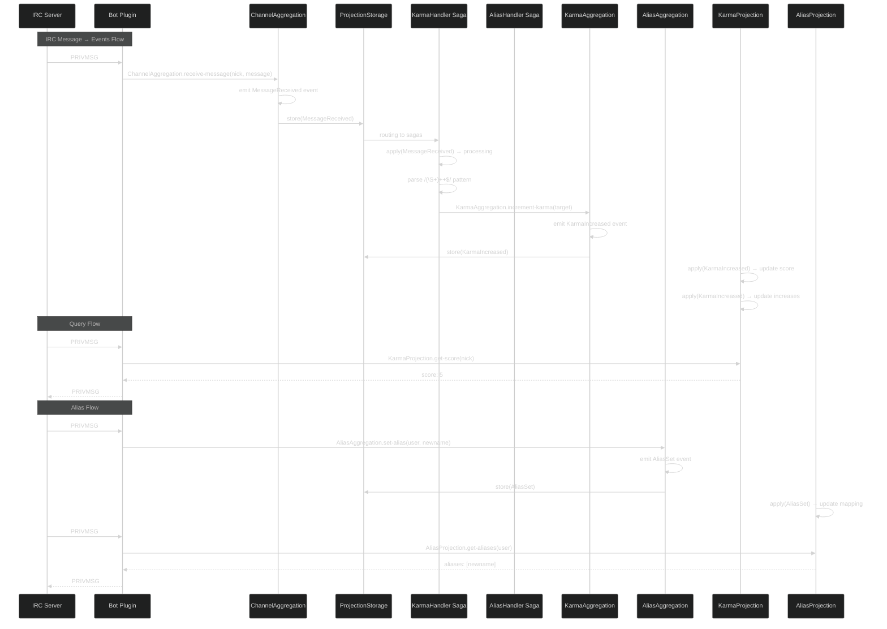

# IRC Bot Example with Sourcing

This example demonstrates how to build an IRC bot using the Sourcing event sourcing library in Raku. It showcases strict CQRS separation with aggregations for commands, projections for queries, and sagas for orchestration.

## Architecture Overview

The IRC bot follows **strict CQRS**:

| Side | Components | Responsibility |
|------|-------------|-----------------|
| **Command** (writes) | ChannelAggregation, KarmaAggregation, AliasAggregation | Receive commands, validate, emit events |
| **Query** (reads) | KarmaProjection, AliasProjection | Store and serve query-optimized data |
| **Orchestration** | KarmaHandler Saga, AliasHandler Saga | Consume events, parse patterns, dispatch to aggregations |

**Key principles:**
- Aggregations emit events but **never** send IRC messages directly
- Projections serve queries but **never** emit events  
- Sagas bridge the two sides by consuming events and calling aggregation commands

## Directory Structure

```
examples/irc-bot/
├── bin/
│   └── irc-bot.raku           # Main bot entry point
├── config.toml                # Bot configuration
├── lib/
│   ├── IRC/
│   │   └── Bot/
│   │       ├── Karma/
│   │       │   ├── Aggregation.rakumod   # Karma write model
│   │       │   └── Events.rakumod        # Karma events
│   │       ├── Alias/
│   │       │   ├── Aggregation.rakumod  # Alias write model
│   │       │   ├── Projection.rakumod   # Alias read model
│   │       │   └── Events.rakumod        # Alias events
│   │       ├── Channel/
│   │       │   ├── Aggregation.rakumod   # Channel message handler
│   │       │   └── Events.rakumod        # Channel events
│   │       ├── Projections/
│   │       │   └── KarmaProjection.rakumod  # Karma read model
│   │       └── Saga/
│   │           ├── KarmaHandler.rakumod    # ++/-- pattern handler
│   │           ├── AliasHandler.rakumod    # => pattern handler
│   │           └── Supply.rakumod          # Saga event processor
│   └── Sourcing/
│       └── Example/
│           └── IRCBot/         # Alternative example implementation
└── t/
    └── 01-irc-bot.rakutest     # Test suite
```

## Key Changes from Previous Implementation

This implementation includes several important fixes:

### 1. New CQRS Architecture
- **Commands flow through aggregations** - `ChannelAggregation.receive-message` emits `MessageReceived` events
- **Queries read from projections** - `KarmaProjection` serves karma scores without emitting events
- **Sagas orchestrate** - KarmaHandler and AliasHandler consume events and call aggregation commands

### 2. Karma Correctly Increments from 0→1→2→...
The karma score now increments correctly instead of staying at 0:
```raku
# In KarmaAggregation
multi method apply(KarmaIncreased $e) {
    $!score = $!score + $e.amount;  # Correct: 0 + 1 = 1
    $!increases++;
}
```

### 3. `$*SourcingReplay` Prevents Command Execution During Replay
When sagas replay events (for already-consumed events), commands are skipped:
```raku
method start {
    $!supply = supply {
        my $*SourcingReplay = False;
        my $s = sourcing self.WHAT;
        whenever $*SourcingConfig.supply -> $event {
            my $*SourcingReplay = $s.^is-replayed-event($event);
            $s.apply: $event
        }
    }
}
```

### 4. Event Type Resolution in SQLite Storage
Event types are resolved using `^can('new')` to check for instantiability:
```raku
my @candidates = @events-handled-by.grep: { .^can('new') };
```

### 5. Cache Key Building Filters Undefined Values
Cache keys now filter out undefined values:
```raku
my $key = %ids.grep: *.value.defined.sort.map: *.key.join('|');
```

## Usage

### Running the Bot

```bash
# Install dependencies
zef install --/test --test-depends --deps-only .

# Run the bot
raku examples/irc-bot/bin/irc-bot.raku
```

### Configuration

Edit `config.toml`:

```toml
nickname = "sourcing-bot"
server = "irc.libera.chat"
port = 6667
channels = "#sourcing"
verbose = "false"
ssl = "false"
```

### Commands

**Query Commands** (read from projections):
- `!karma` - Show your karma score
- `!karma <nick>` - Show someone's karma score
- `!aliases` - Show your aliases
- `!aliases <nick>` - Show someone's aliases

**Command Patterns** (write through aggregations):
- `<nick>++` - Increment someone's karma
- `<nick>--` - Decrement someone's karma
- `<nick>=> <newnick>` - Set an alias

## Implementation Details

### Command Side (Aggregations)

```raku
use Sourcing;

# Channel aggregation - receives all messages
aggregation IRC::Bot::Channel::Aggregation {
    has Str $.channel is projection-id;
    has Int $.message-count = 0;

    multi method apply(MessageReceived $e) {
        $!message-count++;
    }

    method receive-message(Str :$nick, Str :$message) is command {
        self.message-received: :$nick, :$message, :timestamp(DateTime.now);
    }
}

# Karma aggregation - handles ++/--
aggregation IRC::Bot::Karma::Aggregation {
    has Str $.target is projection-id;
    has Int $.score = 0;
    has Int $.increases = 0;
    has Int $.decreases = 0;

    multi method apply(KarmaIncreased $e) {
        $!score = $!score + $e.amount;
        $!increases++;
    }

    method increment-karma(Str :$changed-by, Int :$amount = 1) is command {
        self.karma-increased: :$changed-by, :$amount, :changed-at(DateTime.now);
    }
}
```

### Query Side (Projections)

```raku
use Sourcing;

# Karma projection - serves karma queries
projection IRC::Bot::Projections::KarmaProjection {
    has Str $.target is projection-id;
    has Int $.score = 0;
    has Int $.increases = 0;
    has Int $.decreases = 0;

    multi method apply(KarmaIncreased $e) {
        $!score = $!score + $e.amount;
        $!increases++;
    }

    method status() {
        my $status = $!score > 0 ?? "good" !! $!score < 0 ?? "bad" !! "neutral";
        "{$!score} ($status)";
    }
}
```

### Sagas (Orchestration)

```raku
use Sourcing;

saga IRC::Bot::Saga::KarmaHandler {
    has Str $.saga-id is projection-id;
    has Str $.state = 'idle';

    multi method apply(MessageReceived $e --> 'processing') {
        # Parse ++/-- patterns and call karma aggregation
        if $e.message ~~ /(\S+) \+\+$/ {
            my $target = ~$0;
            my $karma = sourcing IRC::Bot::Karma::Aggregation, :target($target);
            $karma.increment-karma: :changed-by($e.nick);
        }
    }
}
```

## Events

### Channel Events
- `MessageReceived` - Raw IRC message received

### Karma Events
- `KarmaIncreased` - Karma was incremented
- `KarmaDecreased` - Karma was decremented
- `NickChanged` - Nickname was changed

### Alias Events
- `AliasSet` - Alias was created
- `AliasRemoved` - Alias was removed

## Event Flow Sequence



## Testing

```bash
# Run all tests
mi6 test

# Run IRC bot tests
mi6 test t/01-irc-bot.rakutest
```

The test suite covers:
1. Karma aggregation (increment, decrement, state rebuilding)
2. Karma projection (score tracking, status)
3. Alias aggregation (set, remove)
4. Channel aggregation (message handling)
5. End-to-end CQRS flow